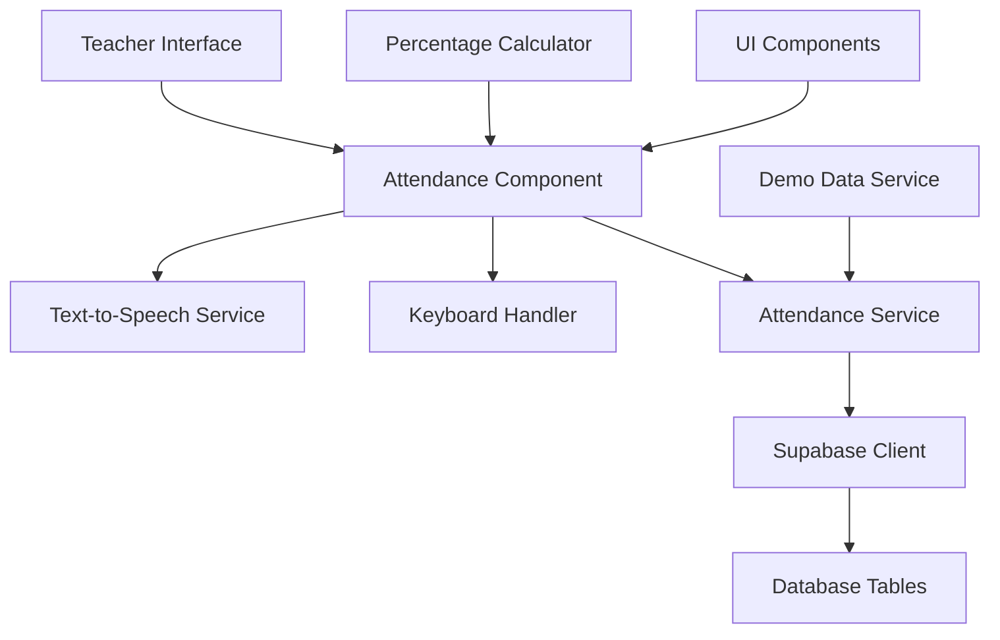

# Design Document - Teacher Attendance Tracking

## Overview

The Teacher Attendance Tracking feature provides an interactive interface for teachers to efficiently mark student attendance using text-to-speech functionality, keyboard shortcuts, and real-time percentage calculations. The system integrates seamlessly with the existing Supabase backend and maintains consistency with the current UI/UX design patterns.

### Key Features
- Interactive roll call with text-to-speech
- Spacebar shortcut for quick absence marking
- Real-time attendance percentage calculations
- Manual attendance override capabilities
- Demo data insertion for testing
- Responsive design matching existing UI patterns

## Architecture

### High-Level Architecture



### Component Structure

```
src/components/teacher/
├── AttendanceTracking/
│   ├── AttendanceTracking.tsx          # Main container component
│   ├── StudentList.tsx                 # Student list display
│   ├── RollCallInterface.tsx           # Text-to-speech controls
│   ├── AttendanceConfirmDialog.tsx     # Spacebar confirmation popup
│   ├── AttendanceStats.tsx             # Real-time percentage display
│   ├── DemoDataButton.tsx              # Demo data insertion
│   └── hooks/
│       ├── useTextToSpeech.ts          # TTS functionality
│       ├── useKeyboardShortcuts.ts     # Keyboard event handling
│       ├── useAttendanceData.ts        # Data fetching and mutations
│       └── useAttendanceCalculations.ts # Percentage calculations
```

## Components and Interfaces

### 1. AttendanceTracking (Main Component)

**Props Interface:**
```typescript
interface AttendanceTrackingProps {
  teacherData: {
    user_id: string;
    first_name: string;
    last_name: string;
  };
}
```

**State Management:**
- Selected class/course
- Current roll call status
- Student list with attendance status
- Real-time percentage calculations

### 2. StudentList Component

**Props Interface:**
```typescript
interface StudentListProps {
  students: Student[];
  currentStudentIndex: number;
  onAttendanceToggle: (studentId: string, status: 'present' | 'absent') => void;
  isRollCallActive: boolean;
}

interface Student {
  id: string;
  first_name: string;
  last_name: string;
  roll_number: string;
  attendance_status: 'present' | 'absent' | 'pending';
  attendance_percentage: number;
}
```

### 3. RollCallInterface Component

**Props Interface:**
```typescript
interface RollCallInterfaceProps {
  students: Student[];
  currentIndex: number;
  isActive: boolean;
  onStart: () => void;
  onPause: () => void;
  onStop: () => void;
  onNext: () => void;
  onPrevious: () => void;
}
```

### 4. AttendanceConfirmDialog Component

**Props Interface:**
```typescript
interface AttendanceConfirmDialogProps {
  isOpen: boolean;
  studentName: string;
  onConfirm: () => void;
  onCancel: () => void;
  autoCloseTimer: number;
}
```

### 5. Custom Hooks

#### useTextToSpeech Hook
```typescript
interface UseTextToSpeechReturn {
  speak: (text: string) => void;
  stop: () => void;
  pause: () => void;
  resume: () => void;
  isSupported: boolean;
  isSpeaking: boolean;
}
```

#### useKeyboardShortcuts Hook
```typescript
interface UseKeyboardShortcutsProps {
  onSpacePress: () => void;
  onEscapePress: () => void;
  isActive: boolean;
}
```

#### useAttendanceData Hook
```typescript
interface UseAttendanceDataReturn {
  students: Student[];
  loading: boolean;
  error: string | null;
  markAttendance: (studentId: string, status: 'present' | 'absent') => Promise<void>;
  fetchStudents: (courseId: string) => Promise<void>;
  insertDemoData: () => Promise<void>;
}
```

## Data Models

### Database Schema Extensions

#### Existing Tables (to be used)
- `attendance` - Core attendance records
- `user_profiles` - Student and teacher information
- `courses` - Course information
- `enrollments` - Student-course relationships

#### Attendance Record Structure
```sql
-- Existing attendance table structure
attendance {
  id: uuid (primary key)
  student_id: uuid (foreign key to user_profiles)
  course_id: uuid (foreign key to courses)
  class_date: date
  status: attendance_status_enum ('present', 'absent', 'late', 'excused')
  marked_by: uuid (foreign key to user_profiles - teacher)
  marked_at: timestamp
  notes: text (optional)
}
```

### TypeScript Interfaces

#### Core Data Types
```typescript
interface AttendanceRecord {
  id: string;
  student_id: string;
  course_id: string;
  class_date: string;
  status: 'present' | 'absent' | 'late' | 'excused';
  marked_by: string;
  marked_at: string;
  notes?: string;
}

interface StudentAttendanceData {
  student: {
    id: string;
    first_name: string;
    last_name: string;
    roll_number: string;
  };
  attendance_percentage: number;
  total_classes: number;
  present_count: number;
  absent_count: number;
  current_status: 'present' | 'absent' | 'pending';
}

interface ClassAttendanceSession {
  course_id: string;
  class_date: string;
  teacher_id: string;
  students: StudentAttendanceData[];
  overall_percentage: number;
  total_students: number;
  present_count: number;
  absent_count: number;
}
```

## Error Handling

### Error Categories

1. **Network Errors**
   - Database connection failures
   - API request timeouts
   - Authentication errors

2. **Browser Compatibility**
   - Text-to-speech API unavailability
   - Keyboard event handling issues

3. **Data Validation**
   - Invalid student data
   - Missing course information
   - Duplicate attendance records

### Error Handling Strategy

```typescript
interface ErrorState {
  type: 'network' | 'browser' | 'validation' | 'unknown';
  message: string;
  recoverable: boolean;
  retryAction?: () => void;
}

// Error handling implementation
const handleError = (error: Error, context: string): ErrorState => {
  // Categorize and format errors
  // Provide user-friendly messages
  // Offer recovery actions where possible
};
```

### Fallback Mechanisms

1. **Text-to-Speech Fallback**
   - Visual highlighting when TTS unavailable
   - Manual navigation controls
   - Screen reader compatibility

2. **Keyboard Shortcut Fallback**
   - Click-based attendance marking
   - Touch-friendly mobile interface

3. **Offline Capability**
   - Local storage for temporary data
   - Sync when connection restored

## Testing Strategy

### Unit Testing

1. **Component Testing**
   - Render testing for all components
   - Props validation
   - Event handler testing
   - State management verification

2. **Hook Testing**
   - Custom hook functionality
   - Side effect management
   - Error handling scenarios

3. **Service Testing**
   - API integration testing
   - Data transformation testing
   - Error scenario handling

### Integration Testing

1. **User Flow Testing**
   - Complete roll call process
   - Manual attendance marking
   - Percentage calculation accuracy
   - Demo data insertion

2. **Browser Compatibility**
   - Text-to-speech across browsers
   - Keyboard event handling
   - Responsive design testing

3. **Database Integration**
   - CRUD operations
   - Real-time updates
   - Data consistency

### Accessibility Testing

1. **Keyboard Navigation**
   - Tab order verification
   - Focus management
   - Shortcut key functionality

2. **Screen Reader Compatibility**
   - ARIA labels and descriptions
   - Semantic HTML structure
   - Alternative text for visual elements

3. **Visual Accessibility**
   - Color contrast compliance
   - Font size and readability
   - High contrast mode support

## Performance Considerations

### Optimization Strategies

1. **Data Fetching**
   - Lazy loading of student lists
   - Caching of attendance data
   - Optimistic updates for better UX

2. **Text-to-Speech Performance**
   - Voice preloading
   - Queue management for multiple announcements
   - Memory cleanup after sessions

3. **Real-time Updates**
   - Debounced percentage calculations
   - Efficient state updates
   - Minimal re-renders

### Monitoring and Analytics

1. **Performance Metrics**
   - Component render times
   - API response times
   - User interaction patterns

2. **Error Tracking**
   - Browser compatibility issues
   - API failure rates
   - User experience problems

## Security Considerations

### Data Protection

1. **Authentication**
   - Teacher role verification
   - Session management
   - Secure API endpoints

2. **Authorization**
   - Course-specific access control
   - Student data privacy
   - Audit trail for attendance changes

3. **Data Validation**
   - Input sanitization
   - SQL injection prevention
   - XSS protection

### Privacy Compliance

1. **Student Data Handling**
   - Minimal data exposure
   - Secure data transmission
   - Compliance with educational privacy laws

2. **Audit Logging**
   - Attendance modification tracking
   - Teacher action logging
   - Data access monitoring

## Integration Points

### Existing System Integration

1. **Teacher Dashboard**
   - Navigation integration
   - Consistent styling
   - Shared state management

2. **Permission System**
   - Role-based access control
   - Feature flag integration
   - PermissionWrapper usage

3. **Notification System**
   - Toast notifications for actions
   - Error message display
   - Success confirmations

### External Services

1. **Web Speech API**
   - Browser compatibility checking
   - Voice selection and configuration
   - Error handling for unsupported browsers

2. **Supabase Integration**
   - Real-time subscriptions
   - Optimistic updates
   - Error handling and retry logic

## Deployment Considerations

### Environment Configuration

1. **Feature Flags**
   - Gradual rollout capability
   - A/B testing support
   - Emergency disable functionality

2. **Browser Support**
   - Progressive enhancement
   - Polyfill requirements
   - Graceful degradation

### Monitoring and Maintenance

1. **Health Checks**
   - Component functionality verification
   - API endpoint monitoring
   - Database connection status

2. **User Feedback**
   - Usage analytics
   - Error reporting
   - Feature adoption metrics